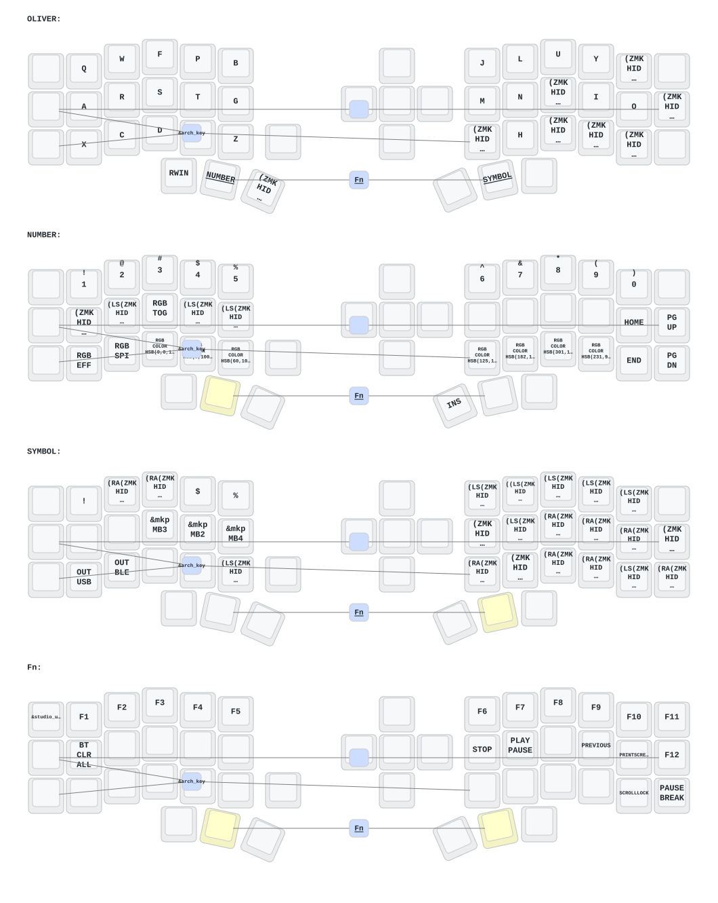

**This keyboard is not the same as [foostan's Corne](https://github.com/foostan/crkbd). It will not work with standard `corne` firmware.**

## Instructions

1. [Fork this repository](https://docs.github.com/en/get-started/quickstart/fork-a-repo#forking-a-repository).
2. [Click the **Actions** tab and make sure the workflow is enabled](https://docs.github.com/en/actions/managing-workflow-runs-and-deployments/managing-workflow-runs/disabling-and-enabling-a-workflow#enabling-a-workflow).
3. Make sure the `eyelash_corne` project in [`config/west.yml`](config/west.yml) still works. The `boards/arm/eyelash_corne` folder will be downloaded from this URL.
4. If there is still a `boards/arm/eyelash_corne` folder in your fork, delete it.

**If you already have a ZMK config repository, [you can add this one as a module instead of forking](https://zmk.dev/docs/features/modules#building-with-modules).**

## Dongle nice!nano

Esta configuración soporta una arquitectura de **dongle** con tres nice!nano:

```text
eyelash_corne izquierda            eyelash_corne derecha
nice!nano                          nice!nano
split peripheral                   split peripheral
        \                          /
         \  BLE / split ZMK       /
          \                      /
           nice!nano #3 (dongle)
           ZMK split central
           USB HID -> PC
```

El PC ve un único teclado USB conectado al tercer nice!nano. Las dos mitades se conectan
inalámbricamente al dongle usando el transporte BLE/split de ZMK. El dongle no tiene
switches, encoder, LEDs ni pantalla: solo actúa como central inalámbrico y dispositivo
USB hacia el host. El encoder físico sigue viviendo en la mitad izquierda y sus eventos
llegan al dongle por el split.

### Firmwares

El workflow de GitHub Actions produce estos artefactos (cada uno en su propio ZIP):

| Placa               | Artefacto                            |
| ------------------- | ------------------------------------ |
| Mitad izquierda     | `eyelash_corne_left`                 |
| Mitad derecha       | `eyelash_corne_right`                |
| Tercer nice!nano    | `eyelash_corne_dongle`               |
| Reset (las tres)    | `settings_reset_nice_nano`           |
| Reset (mitades)     | `settings_reset_eyelash_corne`       |

### Primer flasheo (nuevo emparejamiento)

1. Confirma que el keymap está commiteado en Git (por si hay que revertir).
2. Pon cada nice!nano en modo bootloader UF2 con doble reset.
3. Flashea `settings_reset` en **las tres placas**:
   - `settings_reset_nice_nano` en el dongle;
   - `settings_reset_eyelash_corne` en las dos mitades.
4. Espera a que el reset termine (el LED parpadea y se reinicia solo).
5. Vuelve a entrar al bootloader en cada placa.
6. Flashea `eyelash_corne_left` en la mitad izquierda.
7. Flashea `eyelash_corne_right` en la mitad derecha.
8. Flashea `eyelash_corne_dongle` en el tercer nice!nano.
9. Conecta el dongle al PC por USB.
10. Enciende / reinicia las dos mitades.
11. Verifica el emparejamiento: cada mitad se conecta sola al dongle (el dongle es el
    central BLE, y las mitades son peripherals). Puedes comprobar en el host que el
    teclado USB aparece y que las teclas de ambas mitades funcionan.
12. Si una mitad conserva bonding antiguo o no conecta: repite el `settings_reset` en
    esa placa y en el dongle, y vuelve a emparejar (pasos 3-11).

ZMK Studio se comunica por USB a través del **dongle** (transporte CDC-ACM), no por la
mitad izquierda. Conecta el dongle al PC y usa Studio sobre el puerto serie del dongle.

### Volver al modo anterior (sin dongle)

1. Flashea `settings_reset` en las dos mitades.
2. Compila/reflashea la mitad izquierda **sin** los flags de peripheral
   (`-DCONFIG_ZMK_SPLIT_ROLE_CENTRAL=n`) — por ejemplo usando el `build.yaml` anterior
   o una build manual de `eyelash_corne_left` con `nice_view` sin esos `cmake-args`.
3. Flashea la mitad derecha como antes (ya era peripheral).
4. La izquierda vuelve a ser central y se conecta al PC por USB/BLE como en la
   configuración original.

Nota: el enlace inalámbrico entre mitades y dongle es el transporte BLE/split de ZMK,
no un protocolo 2.4 GHz propietario.

## Keymap Diagram



